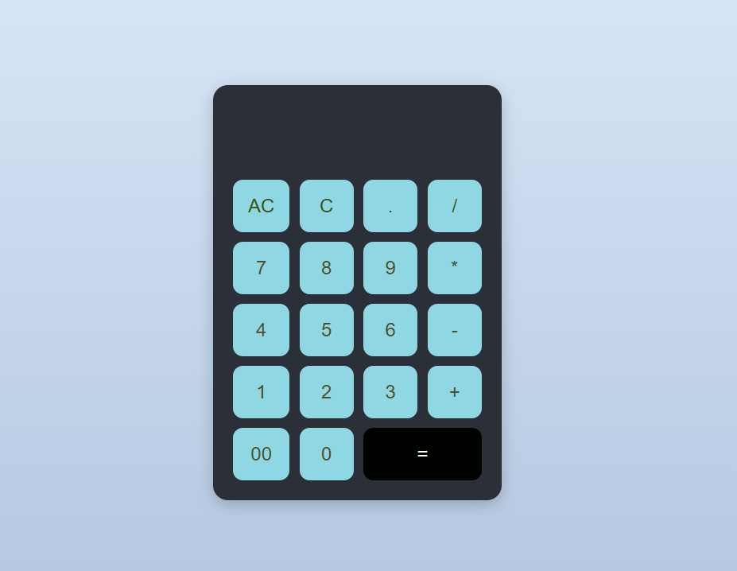

# HTML-CSS-and-JavaScript-Based-Calculator
A basic calculator built with HTML, CSS, and JavaScript for simple arithmetic operations with a clean, responsive design.
## 🚀 Features
- Basic arithmetic operations (`+`, `-`, `*`, `/`)
- Decimal point support
- **AC (All Clear)** and **DE (Delete Last Entry)** functionality
- Responsive and user-friendly UI

## 📸 Screenshot

## 🛠️ Technologies Used
- **HTML** for structuring the calculator layout.
- **CSS** for styling and UI enhancements.
- **JavaScript** for dynamic interactions and calculations.
